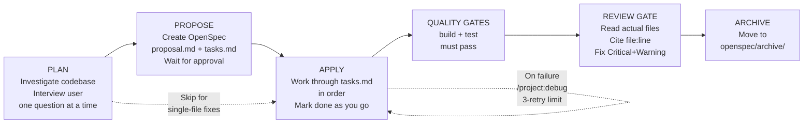
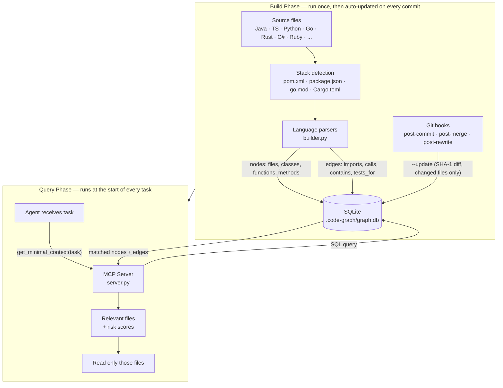
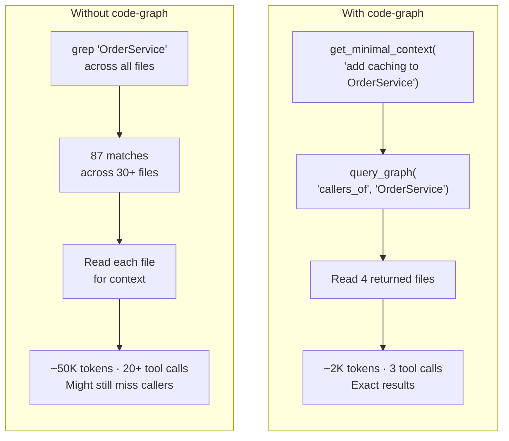

# Copilot Template

Reusable AI coding assistant configuration for any project. Works with **VS Code Copilot**, **Claude Code**, **Cursor**, and **Windsurf**.

Gives AI tools your actual conventions, a structured development workflow, specialized agents with anti-hallucination guardrails, and an optional code-graph MCP server that replaces brute-force file searching with targeted SQLite queries.

---

## Quick Start

### Option A — Automated (recommended)

| Tool | Command |
|------|---------|
| Claude Code | `/project:initialize` |
| VS Code Copilot | Invoke the `initialize-project` skill |

The initializer detects your stack, copies files, fills all placeholders, and optionally sets up the code-graph. Done in ~2 minutes.

### Option B — Manual

See [SETUP.md](SETUP.md) for step-by-step instructions.

### Visualizer

```bash
# From the template (or your project after copying code-graph)
cd .github/code-graph && npm install && cd ../..
uv run --with-requirements .github/code-graph/requirements.txt .github/code-graph/server.py --build
uv run --with-requirements .github/code-graph/requirements.txt .github/code-graph/server.py --visualize
# Open .code-graph/graph.html in your browser
```

### Prerequisites

| Dependency | Required for | Install |
|-----------|-------------|---------|
| Python 3.10+ | Code-graph MCP server (optional) | System package manager |
| [uv](https://docs.astral.sh/uv/) | Running code-graph server | `curl -LsSf https://astral.sh/uv/install.sh \| sh` |

---

## Initialization — What Happens

Running `/project:initialize` or the `initialize-project` skill walks through these steps:

**Step 1 — Gather info**
Asks: target project path, which AI tools to configure (Claude Code / VS Code Copilot / both), sections to skip (i18n, API design, etc.), project-specific rules, and whether to enable the code-graph.

**Step 2 — Detect tech stack**
Reads manifest files in your project (`package.json`, `pom.xml`, `go.mod`, `Cargo.toml`, `tsconfig.json`, etc.) and the `src/` structure. Extracts language, framework, ORM, testing tools, build commands, and key directory paths. Presents findings for your confirmation.

**Step 3 — Copy template files**
Copies only what's relevant to your selected tools. Never overwrites existing files without asking — shows both versions and lets you choose: overwrite, skip, or section-by-section merge.

**Step 4 — Fill placeholders**
Replaces all `_TBD_` and `<!-- FILL: ... -->` markers using the detected stack. Adds your project-specific rules. Removes sections you said to skip.

**Step 5 — Verify**
Greps for remaining `_TBD_` or `<!-- FILL` markers and asks for any still-missing info. Zero markers = done.

**Step 6 — Code-graph setup** (if enabled)
Copies the MCP server files, installs d3, installs `uv` if needed, writes MCP config for your selected tools, builds the initial graph, and optionally installs git hooks for automatic updates.

**Step 7 — Done**
Reports every file created or modified. Asks if you want to commit.

---

## The Workflow

Every non-trivial task follows this sequence. Trivial fixes (single file, obvious change) skip it.



| Step | Claude Code | VS Code Copilot |
|------|-------------|----------------|
| Plan | `/project:plan` | `@Planner` |
| Propose | `openspec-propose` skill | `openspec-propose` skill |
| Apply | `openspec-apply-change` skill | `openspec-apply-change` skill |
| Review | `/project:review` | `@Reviewer` |
| Verify | `/project:verify` | `@Verifier` |
| Debug | `/project:debug` | `@Debugger` |
| Explore | `/project:explore` | `@Explore` |
| Archive | `openspec-archive-change` skill | `openspec-archive-change` skill |

### Example

You drop a ticket description into the chat:

> **Ticket CG-412**: Add email notification when a report is published. Notification should include report title, author, and a direct link. Users can opt out in profile settings.

The agent runs `/project:plan`, investigates the notification and user-settings modules, asks one clarifying question ("push-only or also in-app?"), then creates:

```
openspec/changes/2026-04-09-report-publish-notification/
  .openspec.yaml
  proposal.md          # Why, Goals, Non-Goals, Decisions, Impact, Risks
  specs/notification/
    spec.md            # BDD scenarios: send on publish, opt-out respected, link correct
  tasks.md             # 5 tasks: data model, service, email template, opt-out toggle, tests
```

You approve → agent implements task by task → quality gates → review → done.

### OpenSpec structure

```
openspec/changes/2026-04-09-<slug>/
  .openspec.yaml          # change metadata
  proposal.md             # Why, Goals, Non-Goals, Decisions, Impact, Risks
  specs/<capability>/
    spec.md               # BDD requirements and acceptance scenarios
  tasks.md                # 3-8 implementation tasks with checkboxes
```

Completed changes move to `openspec/changes/archive/`.

---

## Code Graph

> Full technical reference: [.github/code-graph/README.md](.github/code-graph/README.md)

The code-graph is a standalone Python MCP server that parses your entire codebase into a SQLite dependency graph. Agents query it before reading any files — replacing broad searches with targeted lookups.

### Visualize your codebase

```bash
# Install d3 (one-time)
cd .github/code-graph && npm install

# Generate interactive HTML dependency graph
uv run --with-requirements .github/code-graph/requirements.txt .github/code-graph/server.py --visualize
# Output: .code-graph/graph.html — open in browser
```

The visualization shows all files, classes, and functions as nodes, with import/call edges between them. Useful for understanding module boundaries before a large refactor.

### How it works




### Keeping the graph current

The graph stores a SHA-1 hash for every parsed file. `--update` reads only files whose hash has changed — a 200-file project re-parses in milliseconds instead of seconds.

**Git hooks** run `--update` automatically after every commit, merge, and rebase:

```bash
GIT_DIR=$(git rev-parse --git-dir)
cp .github/code-graph/post-commit  "$GIT_DIR/hooks/post-commit"
cp .github/code-graph/post-merge   "$GIT_DIR/hooks/post-merge"
cp .github/code-graph/post-rewrite "$GIT_DIR/hooks/post-rewrite"
chmod +x "$GIT_DIR/hooks/post-commit" "$GIT_DIR/hooks/post-merge" "$GIT_DIR/hooks/post-rewrite"
```

You never need to think about it — commit your code, the graph updates silently in the background. If `graph.db` doesn't exist yet, hooks exit silently. After a major refactor, force a full rebuild:

```bash
uv run --with-requirements .github/code-graph/requirements.txt .github/code-graph/server.py --build
```

### Without vs with code-graph



**Agents gracefully degrade** when the graph is unavailable — all agents fall back to search/read automatically. MCP config, full tool reference, and supported stacks are in [.github/code-graph/README.md](.github/code-graph/README.md).

---

## Agents

There is no separate `@Implementer` agent — the agent that plans and proposes also implements.

| Agent | Purpose | Key constraint |
|-------|---------|----------------|
| **Reviewer** | Strict read-only code review | Reads actual files, never raw diffs. Every finding needs a verbatim quote from a fresh file read — no quote, drop the finding. |
| **Debugger** | Root-cause analysis, minimal fixes | Reproduce → Evidence → Hypothesize → Fix → Verify. Circuit breaker at 3 failed attempts. Scope check after every fix. |
| **Planner** | Interview-driven planning | Investigates codebase before asking user anything. One question at a time. Never implements — hands off to OpenSpec. |
| **Verifier** | Evidence-based completion checks | Fresh evidence only. Runs commands itself, never trusts claims. PASS/FAIL/INCOMPLETE verdict. |
| **Explore** | Fast read-only codebase Q&A | Quick / medium / thorough depth levels. Summary → Evidence → Details output. |

All agents attempt the code-graph first (Phase 0) before reading any file. They fall back to search/read automatically if the graph is unavailable.

---

## Keeping Projects in Sync

When you update copilot-template (new agent rules, parser improvements, bug fixes), registered projects update automatically.

### How it works

1. The initializer writes your project to `projects.json` in copilot-template.
2. A post-merge hook in copilot-template runs after every `git pull`.
3. The hook calls `sync.py`, which copies updated template files to every registered project and rebuilds their code-graphs.

### Install the hook once

```bash
# Run in the copilot-template directory
cp .github/hooks/post-merge .git/hooks/post-merge
chmod +x .git/hooks/post-merge
```

After that, `git pull` in copilot-template is all you need. Sync output is appended to `.github/sync.log`.

### What gets synced

| Synced (pure template) | Skipped (user-customized) |
|------------------------|--------------------------|
| `.github/agents/` | `CLAUDE.md` |
| `.github/skills/` | `.github/copilot-instructions.md` |
| `.github/prompts/` | `openspec/config.yaml` |
| `.github/instructions/` | |
| `.github/code-graph/` | |
| `.claude/commands/project/` | |
| `AGENTS.md` | |

Code-graph is rebuilt automatically for projects with `"code_graph": true` in `projects.json`.

---

## Customization

### After initialization

The `initialize-project` skill fills most placeholders. Review these manually afterward:

1. **Project-Specific Rules** in `copilot-instructions.md` — add domain invariants, module boundaries, naming restrictions
2. **`openspec/config.yaml`** — add your stack and domain context for better AI-generated proposals
3. **`testing.instructions.md`** — uncomment the rules that apply to your test framework
4. **`styling.instructions.md`** — same for CSS methodology

### Trimming for small projects

Keep `.github/copilot-instructions.md` — everything else is optional.

| Don't need… | Delete |
|-------------|--------|
| VS Code Copilot | `.github/agents/`, `.github/skills/`, `.github/prompts/`, `.github/instructions/`, `AGENTS.md` |
| Claude Code | `CLAUDE.md`, `.claude/` |
| OpenSpec workflow | `openspec/`, skill/prompt files referencing OpenSpec |
| Code graph | `.github/code-graph/`, add `.code-graph/` to `.gitignore` |

---

## Reliability Features

### Anti-hallucination
- **Evidence rule** — every review/verify finding must include a verbatim quote from a fresh file read. Diff hunks and memory are not valid sources.
- **Chain-of-verification** — reviewer and verifier self-challenge their own findings before outputting.
- **Graph-first navigation** — agents attempt code-graph queries before reading files. Prevents speculative reads across wrong files.
- **Field/type verification** — agents grep for every name before using it. Stop and ask if not found — never invent types.
- **Context hygiene** — re-read modified files after 10+ turns. Never cite own prior output as evidence.
- **Template guard** — if `_TBD_` placeholders remain in instruction files, stop and ask before coding.

### Workflow safety
- **Circuit breakers** — 3-retry limit on fixes, 3-cycle limit on review loops.
- **Mandatory Phase 0** — code-graph is attempted before any file read. Fallback to grep/read only on failure.
- **Feature inventory** — before editing any file, list all existing features and verify each is preserved in the result.
- **Scope-creep detection** — debugger reviews its own diff after every fix and reverts unrelated changes.
- **Risk-based classification** — auth/security/payments/migrations always get Complex treatment regardless of file count.

### Token efficiency
- **Graph-first** — `get_minimal_context(task)` returns 4-6 relevant files instead of grepping 200+.
- **Progressive disclosure** — testing and styling instructions load only when editing matching files.
- **Memory pointer pattern** — large intermediate results written to files in the OpenSpec directory, referenced by path.
