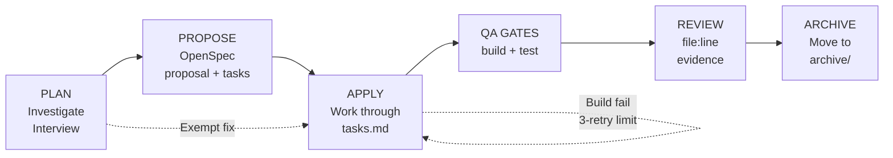
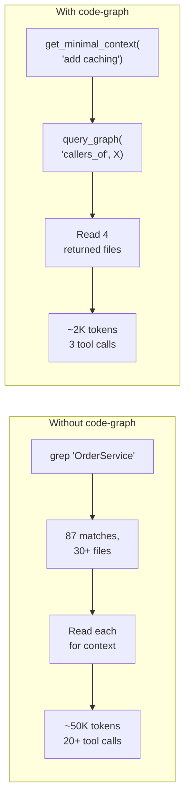

# Copilot Template

> **⚠️ Renamed → [Coograph](https://github.com/paullukic/coograph)**
>
> This repo has moved to **`paullukic/coograph`**. New activity, releases, and documentation live there. This URL stays online for existing clones; please update remotes:
>
> ```bash
> git remote set-url origin https://github.com/paullukic/coograph.git
> ```
>
> Site: **[coograph.com](https://coograph.com)** · Repo: **[github.com/paullukic/coograph](https://github.com/paullukic/coograph)**

Reusable AI coding assistant configuration for any project. Works with **Claude Code**, **VS Code Copilot**, **Cursor**, and **Windsurf**.

Ships a structured workflow, specialized agents with anti-hallucination guardrails, Claude Code lifecycle hooks, and an optional code-graph MCP server that replaces brute-force file searching with targeted SQLite queries.

## Contents

- [Quick Start](#quick-start)
- [What's Inside](#whats-inside)
- [Workflow](#workflow)
- [Agents](#agents)
- [Claude Code Hooks](#claude-code-hooks)
- [Code Graph](#code-graph)
- [Project Sync](#project-sync)
- [Customization](#customization)
- [Reliability](#reliability)

## Quick Start

| Tool | Command |
|------|---------|
| Claude Code | `/project:initialize` |
| VS Code Copilot | Invoke the `initialize-project` skill |

The initializer detects your stack, fills all `_TBD_` placeholders, and optionally sets up the code-graph. About 2 minutes.

Manual setup: see [SETUP.md](SETUP.md). Prerequisites and visualizer: see [.github/code-graph/README.md](.github/code-graph/README.md).

## What's Inside

| Component | Purpose |
|-----------|---------|
| **Workflow** | Plan → Propose → Apply → Review → Archive pipeline |
| **Agents** | 5 specialized agents (Planner, Reviewer, Debugger, Verifier, Explore) |
| **Claude Code Hooks** | Lifecycle hooks — block generated files, log bash, warn on out-of-scope edits, inject graph status |
| **Code Graph** | SQLite dependency graph with MCP server for targeted queries |
| **Instructions** | Domain-specific guidance (testing, styling) loaded on demand |
| **Sync** | Template updates propagate to every registered project on `git pull` |

## Workflow

Every task goes through the full sequence. The only exemptions are narrow and literal: typo fix in a single file, comment/docstring-only edit, user-dictated config-value bump, or follow-up for an already-approved in-progress OpenSpec. "Trivial", "obvious", "small", and "just one tweak" are NOT exemptions.



| Step | Claude Code | VS Code Copilot |
|------|-------------|----------------|
| Start a new ticket | `/project:new-ticket` | `new-ticket` prompt / skill |
| Plan | `/project:plan` | `@Planner` |
| Propose | `openspec-propose` skill | `openspec-propose` skill |
| Apply | `openspec-apply` skill | `openspec-apply` skill |
| Review | `/project:review` | `@Reviewer` |
| Verify | `/project:verify` | `@Verifier` |
| Debug | `/project:debug` | `@Debugger` |
| Explore | `/project:explore` | `@Explore` |
| Archive | `openspec-archive` skill | `openspec-archive` skill |

`/project:new-ticket` is the recommended entry point when you paste a ticket, issue, or task description — it runs pre-flight, investigates the codebase, and hands off to `/project:plan` or the `openspec-propose` skill. Use the individual steps directly when you already know where you are in the workflow.

OpenSpec changes live in `openspec/changes/<date>-<slug>/` with `proposal.md`, `specs/<capability>/spec.md`, and `tasks.md`. Completed changes move to `openspec/changes/archive/`.

## Agents

There is no separate `@Implementer` — the agent that plans also implements.

| Agent | Purpose | Key constraint |
|-------|---------|----------------|
| **Planner** | Interview-driven planning | One question at a time. Never implements. |
| **Reviewer** | Strict read-only code review | Every finding needs a verbatim quote from a fresh read. |
| **Debugger** | Root-cause analysis, minimal fixes | Reproduce → Evidence → Fix → Verify. 3-attempt circuit breaker. |
| **Verifier** | Evidence-based completion checks | Runs commands itself. PASS/FAIL/INCOMPLETE verdict. |
| **Explore** | Fast read-only codebase Q&A | Quick / medium / thorough depth levels. |

All agents MUST call code-graph first — the rule is non-negotiable. Fallback to `sqlite3 .code-graph/graph.db`, and only then to grep/read, is permitted ONLY when the code-graph DB is genuinely absent from the workspace. Convenience is not a valid reason to skip.

## Claude Code Hooks

Lifecycle hooks in `.claude/hooks/`, wired via `.claude/settings.json`. They run automatically on every session — no agent decision, no prompt engineering required.

| Hook | Event | What it does |
|------|-------|--------------|
| **`block-generated.py`** | PreToolUse (Edit/Write) | **Blocks** edits to files under `generated/`, `dist/`, `build/`, `.next/`, `node_modules/`, or anything with `@generated` / `DO NOT EDIT` / `AUTO-GENERATED` in the first 5 lines. Protects codegen output from accidental hand-edits. |
| **`log-bash.py`** | PreToolUse (Bash) | Appends every bash command to `.claude/session.log` (gitignored, per-project). Audit trail for what the agent actually ran. |
| **`report-graph.py`** | SessionStart | Reports code-graph state at session start: `[code-graph] N nodes, M edges, SIZEkb, updated Xh ago`. Prints a rebuild hint if `graph.db` is missing but the server is present. |
| **`warn-scope.py`** | PreToolUse (Edit/Write) | If an active OpenSpec exists, **warns** (non-blocking) when editing a file not referenced in its `tasks.md`. Surfaces scope creep without stopping work. |

Personal or machine-specific overrides go in `.claude/settings.local.json` (gitignored, never synced). `.claude/settings.json` is template-managed and gets overwritten on sync.

## Code Graph

A standalone Python MCP server that parses your codebase into a SQLite dependency graph. Agents query it before reading any files, replacing broad searches with exact lookups.



- **Build once** — tree-sitter parsers for Java, TS, Python, Go, Rust, C#, Ruby, and more walk your source into `.code-graph/graph.db`.
- **Auto-updated** — git hooks (`post-commit`, `post-merge`, `post-rewrite`) re-parse only files whose SHA-1 changed. Millisecond updates.
- **Query first** — agents call `get_minimal_context()` before any file read, falling back to grep only on failure.
- **Visualize** — `server.py --visualize` outputs an interactive `.code-graph/graph.html`.

Full reference (install, MCP config, supported stacks, tool list): [.github/code-graph/README.md](.github/code-graph/README.md).

## Project Sync

Template updates propagate to every registered project automatically.

1. `/project:initialize` writes your project to `projects.json`.
2. Install the hook once in the copilot-template repo:
   ```bash
   cp .github/hooks/post-merge .git/hooks/post-merge
   chmod +x .git/hooks/post-merge
   ```
3. From then on, `git pull` in copilot-template triggers `sync.py`, which copies updated template files to every registered project and rebuilds their code-graphs.

| Synced (template-managed) | Not synced (user-owned) |
|---|---|
| `.github/agents/` | `CLAUDE.md` |
| `.github/skills/` | `.github/copilot-instructions.md` |
| `.github/prompts/` | `openspec/config.yaml` |
| `.github/instructions/` | `.claude/settings.local.json` |
| `.github/code-graph/` | |
| `.claude/commands/project/` | |
| `.claude/hooks/` | |
| `.claude/settings.json` | |
| `AGENTS.md` | |

Sync output appends to `.github/sync.log`.

**Migrations:** when a template update changes a user-owned file (`CLAUDE.md`, `.github/copilot-instructions.md`, `openspec/config.yaml`), sync skips it to preserve your customizations. Any such change is recorded in [MIGRATION.md](MIGRATION.md) with the exact text to apply by hand. Check that file after every `git pull` in copilot-template.

## Customization

After initialization, review these manually:

1. **`copilot-instructions.md`** — Project-Specific Rules section (domain invariants, naming, module boundaries)
2. **`openspec/config.yaml`** — stack and domain context for better AI-generated proposals
3. **`testing.instructions.md`** / **`styling.instructions.md`** — uncomment rules that match your stack

**Trimming for small projects:** only `.github/copilot-instructions.md` is required. Delete any of `.github/agents/`, `.github/skills/`, `.claude/`, `openspec/`, or `.github/code-graph/` you don't use.

## Reliability

**Anti-hallucination**
- Every review/verify finding must cite a verbatim quote from a fresh file read — diffs and memory are not valid sources.
- Agents grep for every name before using it. Never invent types or APIs.
- Re-read modified files after 10+ turns. Never cite prior output as evidence.
- Template guard: if `_TBD_` markers remain in instruction files, agents stop and ask before coding.

**Workflow safety**
- Circuit breakers: 3-retry limit on fixes, 3-cycle limit on review loops.
- Feature inventory: before editing any file, list existing features and verify each is preserved.
- Scope-creep detection: debugger reviews its own diff after every fix and reverts unrelated changes.
- Risk-based classification: auth/security/payments/migrations always get Complex treatment regardless of file count.

**Token efficiency**
- Graph-first: `get_minimal_context(task)` returns 4-6 relevant files instead of grepping 200+.
- Progressive disclosure: testing/styling instructions load only when editing matching files.
- Memory-pointer pattern: large intermediate results written to files, referenced by path.
